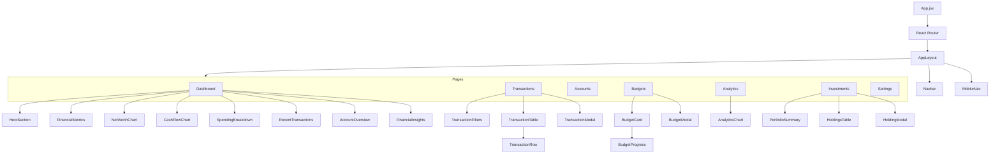

# Ledger — Application Architecture

> System architecture for a client-side personal finance tracker built with React + Vite.

---

## 1. High-Level Overview

```
┌─────────────────────────────────────────────────────────┐
│                      Browser                            │
│                                                         │
│  ┌───────────────────────────────────────────────────┐  │
│  │                 React Application                 │  │
│  │                                                   │  │
│  │  ┌─────────┐  ┌──────────┐  ┌─────────────────┐  │  │
│  │  │  Pages   │→ │Components│→ │   UI Primitives │  │  │
│  │  └────┬────┘  └─────┬────┘  └─────────────────┘  │  │
│  │       │             │                             │  │
│  │       ▼             ▼                             │  │
│  │  ┌──────────────────────────┐                     │  │
│  │  │    Utilities / Helpers   │                     │  │
│  │  │  (calculations, format)  │                     │  │
│  │  └────────────┬─────────────┘                     │  │
│  │               │                                   │  │
│  │               ▼                                   │  │
│  │  ┌──────────────────────────┐                     │  │
│  │  │     Storage Service      │                     │  │
│  │  │   (abstraction layer)    │                     │  │
│  │  └────────────┬─────────────┘                     │  │
│  │               │                                   │  │
│  └───────────────┼───────────────────────────────────┘  │
│                  ▼                                       │
│         ┌────────────────┐                              │
│         │  localStorage  │                              │
│         └────────────────┘                              │
└─────────────────────────────────────────────────────────┘
```

Ledger is a **fully client-side** single-page application. There is no backend server. All data lives in `localStorage` and is accessed through a thin service abstraction that can later be swapped for a remote API (Supabase, Firebase, etc.) without touching component code.

---

## 2. Directory Structure

```
src/
├── main.jsx                  # Entry point — renders <App />
├── App.jsx                   # Router setup, theme provider, global layout
├── index.css                 # Tailwind directives, CSS variables, base styles
│
├── components/
│   ├── layout/
│   │   ├── Navbar.jsx        # Desktop top navigation
│   │   ├── MobileNav.jsx     # Hamburger / bottom nav for small screens
│   │   └── AppLayout.jsx     # Shell: Navbar + <Outlet /> + footer
│   │
│   ├── dashboard/
│   │   ├── HeroSection.jsx       # Greeting, net-worth headline
│   │   ├── FinancialMetrics.jsx  # Five-metric horizontal strip
│   │   ├── NetWorthChart.jsx     # Area/line chart with time-range toggles
│   │   ├── CashFlowChart.jsx     # Income vs. expenses dual-line chart
│   │   ├── SpendingBreakdown.jsx # Donut chart + category list
│   │   ├── RecentTransactions.jsx# Latest 5–8 transactions
│   │   ├── AccountOverview.jsx   # Assets / liabilities summary
│   │   └── FinancialInsights.jsx # Auto-generated insight cards
│   │
│   ├── transactions/
│   │   ├── TransactionTable.jsx  # Sortable, paginated table
│   │   ├── TransactionRow.jsx    # Single row / mobile card
│   │   ├── TransactionFilters.jsx# Search, date, category, account, type filters
│   │   └── TransactionModal.jsx  # Add / edit transaction form
│   │
│   ├── budgets/
│   │   ├── BudgetCard.jsx        # Category budget with progress bar
│   │   ├── BudgetProgress.jsx    # Visual progress indicator
│   │   └── BudgetModal.jsx       # Create / edit budget form
│   │
│   ├── analytics/
│   │   └── AnalyticsChart.jsx    # Reusable chart wrapper for analytics page
│   │
│   ├── investments/
│   │   ├── PortfolioSummary.jsx  # Total value, return, daily change
│   │   ├── HoldingsTable.jsx     # Asset-level holdings table
│   │   └── HoldingModal.jsx      # Add / edit holding form
│   │
│   └── ui/
│       ├── Button.jsx
│       ├── Modal.jsx
│       ├── Input.jsx
│       ├── Select.jsx
│       ├── Badge.jsx
│       ├── EmptyState.jsx
│       └── ConfirmDialog.jsx
│
├── pages/
│   ├── Dashboard.jsx
│   ├── Transactions.jsx
│   ├── Accounts.jsx
│   ├── Budgets.jsx
│   ├── Analytics.jsx
│   ├── Investments.jsx
│   └── Settings.jsx
│
├── data/
│   └── mockData.js           # Seed transactions, accounts, budgets, holdings
│
├── utils/
│   ├── calculations.js       # Net worth, savings rate, category breakdown, etc.
│   ├── formatCurrency.js     # ₹ formatting, compact notation, % formatting
│   └── dateUtils.js          # Month ranges, relative dates, formatting
│
├── services/
│   └── storage.js            # localStorage CRUD abstraction
│
└── contexts/
    ├── ThemeContext.jsx       # Light / dark / system theme state
    └── DataContext.jsx        # Centralised data state + dispatch (optional)
```

---

## 3. Component Hierarchy



---

## 4. Data Flow

### 4.1 Read Path

```
Page mounts
  → calls storage.getTransactions(), storage.getAccounts(), etc.
  → passes raw data to calculation utilities
  → derived values (net worth, savings rate, category breakdown) computed
  → results passed as props to presentation components
  → Recharts renders from derived data arrays
```

### 4.2 Write Path

```
User action (add / edit / delete)
  → TransactionModal validates input
  → calls storage.saveTransaction() / storage.updateTransaction() / storage.deleteTransaction()
  → localStorage updated
  → parent page re-fetches data from storage service
  → all dependent components re-render with fresh calculations
```

### 4.3 State Management Strategy

| Concern | Approach |
|---------|----------|
| **Persisted data** (transactions, accounts, budgets, holdings) | `localStorage` via `services/storage.js`, consumed through `contexts/DataContext.jsx` (`useData()` + `refresh()`). Subscribes to `storage` + `ledger_data_updated` events for cross-tab sync. |
| **Theme** | React Context (`ThemeContext`) — light / dark / system. Persisted in `localStorage`. |
| **UI state** (modal open, active filters, search query, pagination) | Local component state (`useState`). Filters synced to URL (`?search=`) where shareable. |
| **Derived financial data** (net worth, savings rate, etc.) | Computed on the fly via `utils/calculations.js` — no separate store. Memoised with `useMemo` on stable context values. |

> **Why no Redux / Zustand?**
> The app is read-heavy with infrequent writes. Data lives in `localStorage` and is small enough to read synchronously. A context or simple prop-drilling approach keeps the architecture lean. If the app grows to need real-time sync or collaborative editing, a state manager can be introduced behind the same storage service interface.

---

## 5. Routing

| Route | Page Component | Description |
|-------|---------------|-------------|
| `/` | `Dashboard.jsx` | Financial overview — hero, metrics, charts, insights |
| `/transactions` | `Transactions.jsx` | Searchable, filterable transaction list + CRUD |
| `/accounts` | `Accounts.jsx` | Bank accounts & credit cards grouped by type |
| `/budgets` | `Budgets.jsx` | Monthly budget tracking with progress bars |
| `/analytics` | `Analytics.jsx` | Detailed charts — spending, income, savings trends |
| `/investments` | `Investments.jsx` | Portfolio summary, allocation chart, holdings table |
| `/settings` | `Settings.jsx` | Profile, theme, data export/import/clear |

All routes are rendered inside `AppLayout` which provides the `Navbar` and a max-width content container.

---

## 6. Storage Service — Interface Contract

The storage service (`services/storage.js`) exposes a **synchronous API** over `localStorage`
(schema v2, see `STORAGE_KEYS` + `SCHEMA_VERSION` in `constants/finance.js`). Mutations dispatch
`ledger_data_updated` (consumed by `DataContext`) so all pages stay reactive without reloads.

```js
// Transactions (transfer = { type: 'transfer', accountId: from, toAccountId: to })
getTransactions()                → Transaction[]
saveTransaction(tx)              → Transaction       // crypto.randomUUID id, applies balances
updateTransaction(tx)            → Transaction       // also updateTransaction(id, patch)
updateTransaction(id, patch)     → Transaction       // atomic revert+apply, no balance clamp
deleteTransaction(id)            → void              // reverts balance effect

// Accounts (delete is guarded — never orphans transactions)
getAccounts()                    → Account[]
saveAccount(account)             → Account
updateAccount(acc)               → Account           // also updateAccount(id, patch)
getAccountUsage(id)              → { count, hasTransactions }
reassignTransactions(fromId, toId) → number moved
deleteAccount(id, { reassignTo })→ void              // throws ACCOUNT_IN_USE if referenced

// Budgets
getBudgets()                     → Budget[]
saveBudget(budget)               → Budget
updateBudget(budget)             → Budget            // also updateBudget(id, patch)
deleteBudget(id)                 → void

// Investments
getInvestments()                 → Holding[]
saveInvestment(holding)          → Holding
updateInvestment(holding)        → Holding           // also updateInvestment(id, patch)
deleteInvestment(id)             → void

// Settings
getSettings()                    → Settings          // merged over defaults
saveSettings(patch)              → Settings

// Net-worth history (stored snapshots; derived honestly when empty)
getNetWorthHistory()             → History[]
saveNetWorthHistory(arr)         → History[]
saveNetWorthSnapshot({ monthKey, assets, liabilities, netWorth }) → entry

// Data management
exportAllData()                  → JSON string (versioned)
downloadBackup(filename?)        → filename          // Blob download, safe for large data
createPreImportBackup()          → filename|null
validateBackup(obj)              → { ok, errors }
importData(jsonString)           → void              // strict validation, throws INVALID_BACKUP
clearAllData()                   → void              // alias of resetToDemo (backward compat)
resetToDemo()                    → void              // wipe + re-seed demo
eraseAllData()                   → void              // wipe with NO re-seed (true empty state)
subscribeToData(listener)        → unsubscribe
generateId(prefix)               → string (crypto.randomUUID)
```

### Future Migration Path

To migrate to Supabase / Firebase:

1. Create `services/supabaseStorage.js` implementing the same interface but with async calls.
2. Update imports in page components.
3. Wrap calls with `await` / React Query.
4. No component logic changes required.

---

## 7. Data Models

### Transaction

```js
{
  id: "txn_1",              // string, crypto.randomUUID
  type: "expense",          // "expense" | "income" | "transfer"
  merchant: "Swiggy",       // canonical merchant/description (description alias kept)
  description: "Swiggy",   // alias of merchant for backward compat
  category: "Food",        // category string ("Other" for transfers)
  amount: 420,             // positive number (sign determined by type)
  account: "HDFC Savings", // legacy display name (prefer accountId)
  accountId: "acc_1",      // source account id
  toAccountId: "acc_2",    // transfer destination (transfers only)
  date: "2026-08-10",      // ISO date string
  notes: "",               // optional free text (≤500 chars)
  createdAt: "..."         // ISO timestamp
}
```

### Account

```js
{
  id: "acc_1",
  name: "HDFC Savings",
  type: "savings",         // "savings" | "current" | "credit_card" | "cash" | "investment"
  balance: 142500,         // current balance in paisa-free INR
  icon: "building-2",      // Lucide icon name
  createdAt: "..."
}
```

### Budget

```js
{
  id: "bgt_1",
  category: "Food",
  limit: 10000,            // monthly limit
  month: "2026-08",        // YYYY-MM
  createdAt: "..."
}
```

### Holding (Investment)

```js
{
  id: "inv_1",
  name: "Reliance Industries",
  type: "stock",           // "stock" | "mutual_fund" | "gold" | "other"
  units: 10,
  avgPrice: 2450,
  currentPrice: 2680,
  createdAt: "..."
}
```

### Settings

```js
{
  userName: "Aritra",
  currency: "INR",
  theme: "system",         // "light" | "dark" | "system"
  defaultCategory: "Other"
}
```

---

## 8. Calculation Layer

All financial totals are **derived at render time** from raw data — never stored as separate values. This ensures the dashboard is always consistent with the underlying transactions and accounts.

| Function | Inputs | Output |
|----------|--------|--------|
| `calcTotalAssets` | accounts | ₹ sum of savings + current + cash + investment |
| `calcTotalLiabilities` | accounts | ₹ sum of credit card balances |
| `calcNetWorth` | accounts | assets − liabilities |
| `calcMonthlyIncome` | transactions, month | ₹ sum of income transactions in month |
| `calcMonthlyExpenses` | transactions, month | ₹ sum of expense transactions in month |
| `calcSavingsRate` | income, expenses | (income − expenses) / income × 100 |
| `calcCategoryBreakdown` | transactions, month | `[{ category, amount, percentage }]` |
| `calcBudgetUtilization` | budgets, transactions, month | `[{ category, limit, spent, percentage }]` |
| `calcMonthlyCashFlow` | transactions, months | `[{ month, income, expenses, net }]` |
| `calcInvestmentReturn` | holdings | `{ invested, current, return, returnPct }` |
| `calcNetWorthHistory` | monthly snapshots | `[{ month, netWorth }]` |

---

## 9. Theming Architecture

```
ThemeContext
  │
  ├── Provides: { theme, setTheme }
  │     theme = "light" | "dark" | "system"
  │
  ├── On mount: reads localStorage preference
  │     Falls back to system preference via matchMedia
  │
  ├── Applies class "dark" to <html> element
  │
  └── Tailwind dark: variant handles all style switching
```

CSS variables defined in `index.css` power the color system:

```css
:root {
  --bg-primary: #faf8f5;
  --text-primary: #1a1a1a;
  --accent: #d4860b;
  --positive: #2d8a6e;
  --negative: #c24a3a;
  /* ... */
}

.dark {
  --bg-primary: #141414;
  --text-primary: #f0ece6;
  /* ... */
}
```

---

## 10. Chart Architecture

All charts use **Recharts** with a consistent visual language:

| Property | Value |
|----------|-------|
| Grid lines | Light gray, dashed, minimal |
| Axis labels | Small, muted, Inter font |
| Tooltip | Custom component, minimal border, shadow-sm |
| Line stroke | 2px |
| Area fill | Gradient with low opacity |
| Animation | `animationDuration={800}` |
| Responsive | Wrapped in `<ResponsiveContainer>` |

Charts receive **pre-computed data arrays** from parent pages — they never call the storage service directly.

---

## 11. Responsive Strategy

| Breakpoint | Layout |
|------------|--------|
| `< 640px` (mobile) | Single column, bottom nav or hamburger, stacked cards instead of tables, full-width charts |
| `640–1024px` (tablet) | Two-column grid, compressed spacing, top nav |
| `> 1024px` (desktop) | Full 12-column grid, max-width 1400px, spacious padding, side-by-side sections |

Key responsive adaptations:

- **Transaction table** → stacked cards on mobile
- **Dashboard metrics** → 2-column or single-column wrap
- **Charts** → full-width, reduced height
- **Modals** → full-screen drawers on mobile
- **Navigation** → hamburger menu or bottom tab bar

---

## 12. Key Architectural Decisions

| Decision | Rationale |
|----------|-----------|
| **No global state manager** | App is small; localStorage reads are synchronous and fast. Context handles theme only. |
| **Derived calculations, not stored totals** | Single source of truth. No risk of stale aggregated data. |
| **Storage service abstraction** | Decouples persistence from UI. Enables future backend migration. |
| **Tailwind CSS** | Utility-first CSS matches the component-based architecture. Theme extension handles the custom design system. |
| **Recharts** | Lightweight, composable, React-native charting. Good fit for the minimal chart style. |
| **No TypeScript** | Per spec — JavaScript only. Type safety can be added later if needed. |
| **Page-level data fetching** | Each page reads its own data on mount. Keeps components focused and avoids prop drilling through many layers. |
