# Folio System Architecture

> Architectural design and patterns for the Folio local-first personal wealth tracker.

---

## 1. High-Level Overview

Folio is a **fully client-side** single-page application built on React 18 and Vite. There is no backend database or external server dependency. All data resides in the user's browser via `localStorage` and is managed through a clean storage abstraction layer paired with a reactive `DataContext`.

```
┌────────────────────────────────────────────────────────────────────────┐
│                               Browser                                  │
│                                                                        │
│   ┌────────────────────────────────────────────────────────────────┐   │
│   │                        React 18 SPA                            │   │
│   │                                                                │   │
│   │   ┌──────────────┐      ┌──────────────┐      ┌────────────┐   │   │
│   │   │  Route Pages │  ──▶ │  Components  │  ──▶ │UI Primitives│  │
│   │   └──────┬───────┘      └──────┬───────┘      └────────────┘   │   │
│   │          │                     │                               │   │
│   │          ▼                     ▼                               │   │
│   │   ┌────────────────────────────────────────────────────────┐   │   │
│   │   │           DataContext (Reactive Store & State)         │   │   │
│   │   │    - Cross-tab synchronization (`storage` events)      │   │   │
│   │   │    - Custom event dispatch (`ledger_data_updated`)     │   │   │
│   │   └───────────────────────────┬────────────────────────────┘   │   │
│   │                               │                                │   │
│   │                               ▼                                │   │
│   │   ┌────────────────────────────────────────────────────────┐   │   │
│   │   │            Storage Service (`services/storage.js`)     │   │   │
│   │   │    - Schema v2 validation & migrations                 │   │   │
│   │   │    - Atomic double-entry balance updates               │   │   │
│   │   │    - Guarded account deletes & transfer integrity      │   │   │
│   │   │    - JSON backup export / import validation            │   │   │
│   │   └───────────────────────────┬────────────────────────────┘   │   │
│   │                               │                                │   │
│   │                               ▼                                │   │
│   │   ┌────────────────────────────────────────────────────────┐   │   │
│   │   │     Pure Calculations Layer (`utils/calculations.js`)   │   │   │
│   │   │    - Single source of truth for net worth & metrics    │   │   │
│   │   └────────────────────────────────────────────────────────┘   │   │
│   └───────────────────────────────┼────────────────────────────────┘   │
│                                   ▼                                    │
│                         ┌───────────────────┐                          │
│                         │   localStorage    │                          │
│                         └───────────────────┘                          │
└────────────────────────────────────────────────────────────────────────┘
```

---

## 2. Component Hierarchy

```mermaid
graph TD
    App["App.jsx"] --> Router["React Router v6"]
    Router --> Layout["AppLayout.jsx"]
    Layout --> Navbar["Navbar.jsx"]
    Layout --> MobileNav["MobileNav.jsx"]
    Layout --> GlobalSearch["GlobalSearch.jsx (⌘K)"]
    Layout --> ScrollToTop["ScrollToTop.jsx"]
    Layout --> ErrorBoundary["ErrorBoundary.jsx"]
    Layout --> Outlet["<Outlet />"]

    subgraph Pages
        Outlet --> Dashboard["DashboardPage.jsx"]
        Outlet --> Transactions["TransactionsPage.jsx"]
        Outlet --> Accounts["AccountsPage.jsx"]
        Outlet --> Budgets["BudgetsPage.jsx"]
        Outlet --> Analytics["AnalyticsPage.jsx"]
        Outlet --> Investments["InvestmentsPage.jsx"]
        Outlet --> Settings["SettingsPage.jsx"]
        Outlet --> NotFound["NotFoundPage.jsx"]
    end

    Dashboard --> HeroSection
    Dashboard --> FinancialMetrics
    Dashboard --> NetWorthChart
    Dashboard --> CashFlowChart
    Dashboard --> SpendingBreakdown
    Dashboard --> RecentTransactions
    Dashboard --> AccountOverview
    Dashboard --> FinancialInsights

    Transactions --> TransactionFilters
    Transactions --> TransactionTable
    Transactions --> TransactionModal
    TransactionTable --> TransactionRow

    Accounts --> AccountCard
    Accounts --> AccountModal

    Budgets --> BudgetCard
    Budgets --> BudgetProgress
    Budgets --> BudgetModal

    Investments --> PortfolioSummary
    Investments --> AllocationChart
    Investments --> HoldingsTable
    Investments --> HoldingModal
    Investments --> PortfolioValueChart
```



---

## 3. State Management & Reactivity

| Concern                    | Implementation                               | Characteristics                                                                                                                                                                            |
| :------------------------- | :------------------------------------------- | :----------------------------------------------------------------------------------------------------------------------------------------------------------------------------------------- |
| **Persisted Data**         | `DataContext.jsx` over `services/storage.js` | Synchronous `localStorage` access wrapped in a reactive Context provider. Emits and listens to `ledger_data_updated` custom events and window `storage` events for instant multi-tab sync. |
| **Active Theme**           | `ThemeProvider.jsx`                          | Supports `light`, `dark`, and `system` modes. Toggles the `.dark` CSS class on `<html>` and persists preference in storage.                                                                |
| **Route State**            | React Router v6                              | Lazy route loading with React `Suspense`, dynamic title hooks, and scroll-to-top on route changes.                                                                                         |
| **Derived Financial Data** | `utils/calculations.js`                      | Pure functional calculators compute net worth, cash flow, category distributions, and savings rates on the fly. Zero stored aggregates prevent stale state bugs.                           |
| **Local UI State**         | React `useState` & `useMemo`                 | Modals, active filters, search drawers, and pagination maintain local state, with URL query syncing where appropriate.                                                                     |

---

## 4. Routing Architecture

Folio uses code-split route definitions to optimize bundle size:

| Path            | Component              | Chunk Strategy | Purpose                                                           |
| :-------------- | :--------------------- | :------------- | :---------------------------------------------------------------- |
| `/`             | `DashboardPage.jsx`    | Code-split     | Executive wealth overview, net worth timeline, recent activity    |
| `/transactions` | `TransactionsPage.jsx` | Code-split     | Complete ledger, search, filters, pagination, transaction CRUD    |
| `/accounts`     | `AccountsPage.jsx`     | Code-split     | Asset and liability accounts, guarded balance adjustments         |
| `/budgets`      | `BudgetsPage.jsx`      | Code-split     | Monthly budget allocations and utilization progress meters        |
| `/analytics`    | `AnalyticsPage.jsx`    | Code-split     | Deep dive financial insights, monthly comparisons, savings trends |
| `/investments`  | `InvestmentsPage.jsx`  | Code-split     | Portfolio allocation, asset-class breakdown, holdings tracker     |
| `/settings`     | `SettingsPage.jsx`     | Code-split     | Currency format, data export/import, backup restoration, theme    |
| `*`             | `NotFoundPage.jsx`     | Code-split     | Graceful 404 fallback page                                        |

---

## 5. Design System & Theming

The visual language follows an **editorial private-wealth aesthetic**:

- **Palette**: Warm ivory backgrounds (`#FDFBF7`), zinc text hierarchies (`#18181B`), and warm amber brand accents (`#D97706`).
- **Dark Mode**: OLED dark backgrounds (`#141414`), charcoal cards (`#1E1E1E`), and soft golden accents (`#F59E0B`).
- **Typography**:
  - Headings: `Playfair Display` (editorial serif)
  - Body & UI: `Inter` (neutral geometric sans)
  - Numerics: Monospace formatting (`mono` class) with tabular numbers for financial balance precision.
- **Micro-Interactions**: Smooth cubic-bezier transitions, hover underlines, count-up animations for large currency values, and responsive drawer modals.

---

## 6. In-Browser AI Statement Ingestion Architecture

Folio provides a privacy-first, automated bank and credit card statement ingestion pipeline that eliminates manual transaction entry fatigue while keeping user financial data strictly client-side:

```
┌────────────────────────────────────────────────────────────────────────┐
│                    In-Browser Statement Ingestion                      │
│                                                                        │
│   [PDF Statement File]                                                 │
│            │                                                           │
│            ▼                                                           │
│   ┌─────────────────────────────────┐                                  │
│   │   PDF.js Decryption & Reader    │ ◀─── Bank-Specific Password Hint  │
│   │   (`services/pdfParser.js`)     │      (DOB, Pan, Name formats)    │
│   └────────────────┬────────────────┘                                  │
│                    │ Raw text streams                                  │
│                    ▼                                                           │
│   ┌─────────────────────────────────┐                                  │
│   │   Google Gemini 1.5 Flash       │ ◀─── Optional user API Key       │
│   │   Structured JSON Extraction    │      (Or Instant Offline Demo)   │
│   └────────────────┬────────────────┘                                  │
│                    │ Parsed transaction objects                        │
│                    ▼                                                           │
│   ┌─────────────────────────────────┐                                  │
│   │   Duplicate Detection Staging   │ ◀─── Date, amount & merchant     │
│   │   (`findPotentialDuplicates`)   │      proximity matching          │
│   └────────────────┬────────────────┘                                  │
│                    │ User-reviewed batch                               │
│                    ▼                                                           │
│   ┌─────────────────────────────────┐                                  │
│   │   Atomic Batch Balance Storage  │                                  │
│   │   (`saveTransactionsBatch`)     │ ──▶  localStorage                │
│   └─────────────────────────────────┘                                  │
└────────────────────────────────────────────────────────────────────────┘
```

1. **Client-Side PDF Decryption**: `pdfjs-dist` loads directly in the browser. Encrypted e-statements prompt the user with pre-configured password patterns for major Indian banks (HDFC, ICICI, SBI, Axis, Cred).
2. **AI Parsing with Strict Schema**: Extracted statement text is processed via Google Gemini 1.5 Flash using `responseMimeType: 'application/json'`. Extracted records contain `date`, `merchant`, `amount`, `category`, and `type` (debit/credit).
3. **Interactive Demo Mode**: Users can test ingestion instantly without entering an API key using bundled real-world statements from HDFC Bank and ICICI Amazon Pay Credit Card.
4. **Staging & Duplicate Protection**: Before committing transactions, transactions are previewed in an interactive review modal where existing transactions with matching dates, amounts, and merchant names are flagged to prevent duplicate entries.

---

## 7. Dual Spending & Debt Segregation Engine

Folio explicitly segregates spending across two distinct behavioral channels:

1. **Liquid Savings Account Spending**: Outflows made directly from checking, savings, or cash via UPI, NetBanking, and debit cards.
2. **Credit Card Debt Spending**: Unsettled liabilities accrued through credit card swipes and merchant purchases.
3. **Bill Payment Isolation**: Transfers from a savings account to a credit card to settle monthly statements are identified and excluded from expense metrics, preventing double-counting.

This logic is implemented in `calcSavingsVsCreditSpending` and visualized in the `SavingsVsCreditChart` and `AiSpendingAdvisor` components.

---

## 8. Indian Wealth Management Ecosystem

Folio caters to the Indian personal wealth landscape across four primary asset classes:

- **Equities & Stocks**: Direct stock tracking with average buy price, current market price, and unrealized P&L.
- **Mutual Funds (AMFI Live NAV)**: Real-time search and daily NAV tracking powered by the public AMFI India Mutual Fund API (`api.mfapi.in`), with auto-fill of historical purchase NAVs and current valuation.
- **Fixed Deposits (FDs)**: Indian banking standard quarterly compounding calculator ($A = P(1 + r/4)^{4t}$) tracking accrued interest, maturity valuation, days remaining, and visual progress meters.
- **Bonds & Sovereign Gold Bonds (SGBs)**: Face value, annual coupon yields (e.g. 2.5% p.a. for SGBs), and maturity timelines.

---

## 9. Zero-Backend Migration Trajectory

Folio's clean storage abstraction enables future remote backend integrations without altering presentation components:

```js
// Current: Synchronous LocalStorage Adapter
export function getTransactions() {
  return read(STORAGE_KEYS.TRANSACTIONS, []);
}

// Future: Cloud / Supabase Adapter
export async function getTransactions() {
  const { data } = await supabase.from('transactions').select('*');
  return data;
}
```

Because component pages interact solely with `DataContext` and `storage.js` contracts, migrating to Supabase, Firebase, or an encrypted WebDAV store requires swapping the storage service implementation without refactoring the UI.
